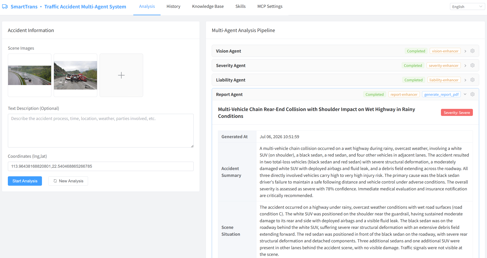
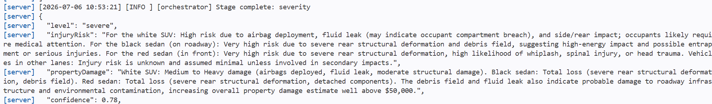
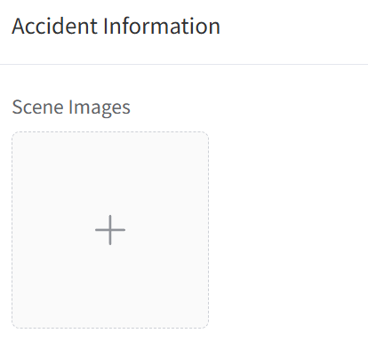
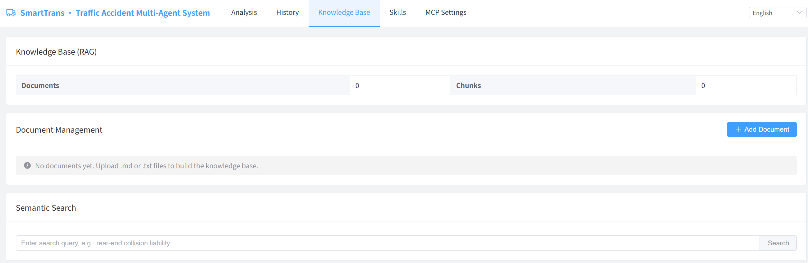
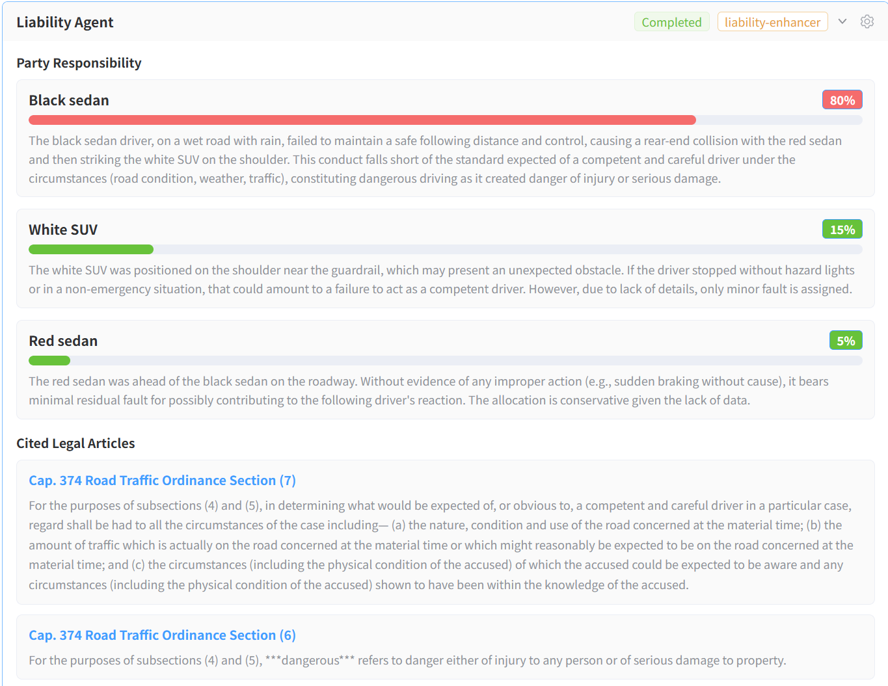
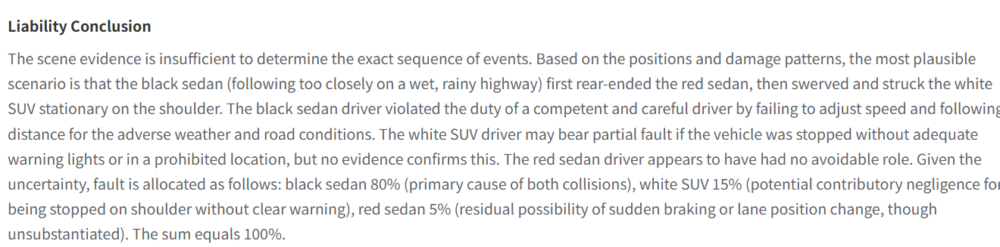
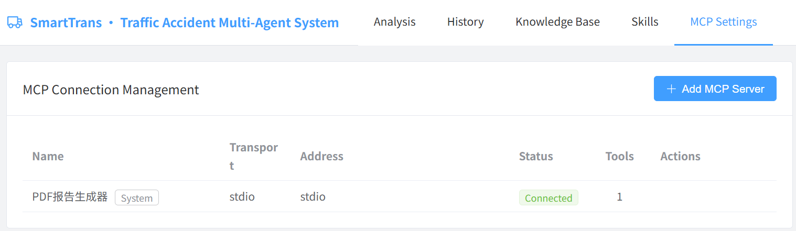
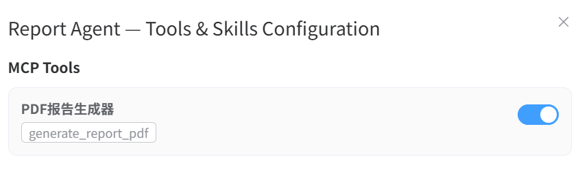
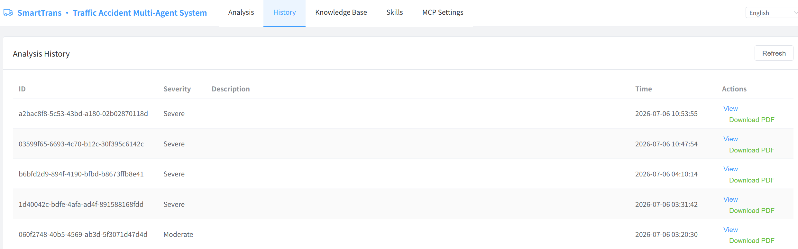

# SmartTrans User Guide

> A demonstration platform that uses AI-powered traffic accident analysis to make five foundational concepts of enterprise AI tangible and experiential.

---

## Executive Summary

SmartTrans illustrates five concepts that together define the modern AI agent stack:

| Concept | The Question It Answers |
|---------|------------------------|
| **Prompt** | How do you give an AI a professional identity — so it says the *right* thing? |
| **Agent** | How do you combine role, knowledge, and tools into a digital specialist that completes tasks? |
| **RAG** | How do you give an AI access to authoritative reference documents — so it cites facts, not memories? |
| **MCP** | How do you equip an AI with tools — so it executes actions, not just offers advice? |
| **Skills** | How do you make AI expertise modular — so domain experts can evolve capabilities without engineering? |

These five form a capability stack: **Prompts** define identity → **Agents** wrap identity, knowledge, and tools → **RAG** provides authoritative knowledge → **MCP** delivers executable tools → **Skills** make expertise swappable.

---

## Core Concepts at a Glance

| Concept | One-Line Understanding |
|---------|----------------------|
| **Prompt** | A "professional contract" — defines which path the AI *should* take |
| **Agent** | Role + knowledge + tools = a digital specialist that completes tasks |
| **Structured Output** | Verifiable, auditable data structures instead of free-form text |
| **RAG** | A reference library — look up facts rather than rely on training memory |
| **Vector Embedding** | Making semantics computable — turning meaning into measurable math |
| **Tool Calling** | AI autonomously decides when and which tool to invoke |
| **MCP** | A universal protocol for tool integration — one standard, any service |
| **Skill** | Modular expertise package — upgrade capabilities without code changes |

---

## 1. Prompt — The Professional Contract

**The core question**: How do you make an AI go from "chatting" to "being professional"?

### 1.1 Experience the Pipeline

1. Open the system. Confirm you are on the **「Accident Analysis」** tab.
2. In the left panel **「Case Information」** area:
   - Click `+` to upload traffic accident scene images.
   - Fill in the **Text Description** field, for example:
     > At 3:00 PM on June 15, 2024, at a major urban intersection, Vehicle A traveling straight collided with Vehicle B making a left turn. Weather was clear, road surface was dry.
   - Click **「Start Analysis」**.
3. Watch the pipeline execute in the right panel and wait for the report.

> 💡 The language switcher in the top-right corner lets you choose English, Simplified Chinese, or Traditional Chinese. The entire pipeline operates in your selected language.



### 1.2 The Multi-Agent Architecture

The system decomposes analysis into a relay of four **specialized agents**:

| Stage | Agent | Responsibility |
|-------|-------|----------------|
| ① | Vision Agent | Understand the visual information of the accident scene |
| ② | Severity Agent | Assess accident severity level and damage risks |
| ③ | Liability Agent | Determine fault percentages and cite legal references |
| ④ | Report Agent | Synthesize all analyses into a decision-support report |

Status indicators update in real time: `Waiting` → `Analyzing` → `Complete`. Output of one stage is input to the next.

### 1.3 Why Prompts Matter

Three of the four agents (Severity, Liability, Report) are powered by the **same underlying AI model** (DeepSeek-V4). Yet they behave as entirely different specialists. The difference is entirely in their prompts.

Consider the same accident photo shown to different observers:
- Traffic officer → focuses on liability-relevant details.
- Insurance adjuster → focuses on loss-relevant details.
- Bystander → just sees "two cars crashed."

> **Core insight**: A prompt is a "professional contract." One model can serve dozens of business functions — each defined by its prompt, not its architecture.

### 1.4 Why Multi-Agent

A single AI handling everything leads to **attention dilution** — switching between vision, assessment, and legal reasoning. Multi-agent is **cognitive division of labor**: each agent has one responsibility, communicates through structured output, and deviations are localized.

### 1.5 Structured Output: The Dependable Interface

Every agent's output is a **rigorously constrained data structure** — not free-form text. Structured data can be validated, transmitted, and audited. It is the dependable interface between agents.



---

## 2. Agent — The Digital Specialist

**The core question**: What exactly *is* an Agent, and how does it differ from a chatbot?

### 2.1 What Defines an Agent

| Element | Provided By | What It Does |
|---------|-------------|--------------|
| **Role** | Prompt | Defines professional identity, scope, and methodology |
| **Knowledge** | Training data + RAG | Access to facts — trained and retrievable |
| **Tools** | MCP | Ability to act — generate files, query services, call APIs |

An agent is a **digital specialist**: defined scope + reference materials + ability to act. It executes tasks end-to-end, not just responds to prompts.

### 2.2 Agent vs. Chatbot

| Dimension | Chatbot | Agent |
|-----------|---------|-------|
| **Mode** | Answers questions | Completes tasks |
| **State** | Stateless | Stateful — carries context through multi-step process |
| **Output** | Free-form text | Structured, validated data |
| **Capability** | Text generation only | Tool-equipped — retrieve, compute, generate, call APIs |
| **Reasoning** | Single-turn | Multi-step, autonomous tool-use decisions |
| **Accountability** | Output unverifiable | Output validated against schema |

A chatbot tells you what you *should* do. An agent *does* it.

### 2.3 The Four Agents of SmartTrans

| Agent | Model | Prompt Defines... | Tools Include... |
|-------|-------|-------------------|------------------|
| **Vision Agent** | Qwen3-VL (vision) | How to observe accident scenes | — (pure perception) |
| **Severity Agent** | DeepSeek-V4 (reasoning) | How to classify damage and risk | RAG legal references |
| **Liability Agent** | DeepSeek-V4 (reasoning) | How to determine fault and cite law | RAG legal references |
| **Report Agent** | DeepSeek-V4 (reasoning) | How to synthesize into a report | PDF generation, map geocoding |

The pipeline is a **data relay**, not a conversation.

> **Core insight**: An agent transforms a general-purpose model into a reliable, auditable, tool-equipped digital worker that plugs into business processes.

---

## 3. RAG — The Knowledge Foundation

**The core question**: What gives an AI the authority to say "according to relevant laws"?

### 3.1 Experience It

1. Switch to the **「Knowledge Base」** tab.
2. Upload documents: Click **「Add Document」** → drag a `.md` or `.txt` file → click **「Upload」**.
   
3. Try **semantic search**: enter `rear-end collision liability determination` → click **「Search」**. Observe **distance scores** — they measure semantic closeness.
   
4. Return to **「Accident Analysis」**, re-run, and compare Liability output — before and after having a knowledge base.

### 3.2 What Changed

Without a knowledge base: "according to relevant laws and regulations…" — vague, unverifiable.

With a knowledge base: specific articles cited, verbatim text shown, relevance to case explained.




### 3.3 The Essence of RAG

**Rather than making the AI memorize everything, give it a reference library.** Three problems RAG solves: knowledge cutoff (documents update anytime), hallucination risk (constrained to real documents), domain depth (specialist knowledge without retraining).

> **Core insight**: RAG means your proprietary documents become the AI's source of truth — updatable, auditable, controlled by you.

### 3.4 Chunking and Vectorization

- **Chunking**: The system detects **「Article X」** markers and splits by article. Precise retrieval requires precise granularity.
- **Vectorization**: Each unit → 4,096-dimensional vector. "Rear-end collision" and "vehicle behind strikes rear of vehicle ahead" are different in characters but close in vector space — vectors capture *meaning*, not *spelling*.

---

## 4. MCP — From Advisor to Executor

**The core question**: Can an AI do more than "talk" — can it actually "act"?

### 4.1 Prerequisites

MCP must be enabled server-side (`MCP_ENABLED=true`). If the **「MCP Settings」** tab is not visible, contact the administrator.

### 4.2 Experience It

1. Switch to **「MCP Settings」**. You will see a <el-tag size="small" type="info">System</el-tag> connection: **「PDF Report Generator」** — a preset that generates formal PDF documents.
   
2. Enable the tool: go to **「Accident Analysis」** → click ⚙️ on the **Report Agent** → **「MCP Tools」** tab → toggle **「PDF Report Generator」** on.
   
3. Run analysis → switch to **「History」** → click **「Download PDF」** to get a formatted report.
   

### 4.3 Tool Calling: Crossing from Advice to Action

```
Understand the need → autonomously decide which tool to call → pass parameters → receive results → continue reasoning
```

The AI itself judges *when* to call, *which* tool, and *how* to interpret the result — not a pre-scripted workflow.

> **Core insight**: Without tools, AI is a "consultant." With tools, AI becomes an "executor" — crossing from decision support to process automation.

### 4.4 MCP: A Universal Protocol

MCP solves the N×M scaling problem (10 systems × 50 APIs = 500 custom integrations). One standard for discovery, invocation, and extension. MCP is to AI tools what USB is to computer peripherals.

### 4.5 System Connections vs. User Connections

| Type | Characteristics | Management |
|------|----------------|-------------|
| **System Connections** | Preset, non-deletable; platform-native capabilities | Platform maintains |
| **User Connections** | User-added; on-demand external capabilities | User manages lifecycle |

Use **「Add MCP Server」** to connect external services — mapping, weather, databases — growing the AI's capability map organically.

---

## 5. Skills — Evolve Without Rewriting Code

**The core question**: Can we upgrade an AI agent's capabilities without touching code?

### 5.1 Experience It

1. Switch to the **「Skills」** tab. Four pre-installed system skills, each <el-tag size="small" type="info">System</el-tag> and non-deletable:

   | Skill | Default Agent | Purpose |
   |-------|---------------|---------|
   | `vision-enhancer` | Vision | Damage classification, road condition grading, weather/lighting analysis |
   | `severity-enhancer` | Severity | Injury risk classification, multi-factor severity matrix |
   | `liability-enhancer` | Liability | Fault assessment criteria, accident-type responsibility splits |
   | `report-enhancer` | Report | Report template, post-accident checklists, language consistency |

2. Create a custom skill: Click **「New Skill」** → paste a `SKILL.md` document:

   ```markdown
   ---
   name: severity-checklist
   description: |
     A structured checklist for comprehensive severity assessment,
     covering vehicle damage grades, injury classification,
     and environmental hazard evaluation.
   ---

   # Severity Assessment Checklist

   ## Instructions

   When assessing accident severity, systematically evaluate:

   ### 1. Vehicle Damage
   - Level A: Cosmetic damage only (scratches, dents)
   - Level B: Functional damage (lights, mirrors, windows)
   - Level C: Structural damage (frame, axles, crumple zones)
   - Level D: Total loss

   ### 2. Injury Classification
   - Minor: Bruises, whiplash — outpatient treatment
   - Moderate: Fractures, lacerations — hospitalization < 7 days
   - Severe: Life-threatening, permanent disability — hospitalization ≥ 7 days
   - Fatal: One or more fatalities

   ### 3. Environmental Hazards
   - Fluid spills (fuel, oil, coolant)
   - Road blockage (partial or full lane closure)
   - Secondary collision risk (blind curves, high-speed traffic)
   ```

3. Bind to agent: **「Accident Analysis」** → ⚙️ on **Severity Agent** → **「Skills」** tab → toggle `severity-checklist` on.

4. Run analysis — the Severity Agent step shows a <el-tag type="warning">severity-checklist</el-tag> tag and the assessment reflects the structured checklist approach.

### 5.2 What Happened

A **Skill** is a reusable capability package stored as `SKILL.md` under `server/data/skills/<skill-name>/`. At runtime:

1. `SkillsManager` parses all `SKILL.md` files at startup.
2. The orchestrator queries enabled skills per agent (merging persisted bindings + per-request selections).
3. Skills are injected into the agent's system prompt with boundary markers:

```
--- BEGIN SKILLS ---
[Skill: severity-checklist]
Description: A structured checklist for comprehensive severity assessment...
Instructions:
# Severity Assessment Checklist
...
[/Skill: severity-checklist]
--- END SKILLS ---
```

### 5.3 Skills in the Capability Stack

| Mechanism | Metaphor | What It Does |
|-----------|----------|--------------|
| **Prompt** | Job description | Defines *what kind of expert* the agent is |
| **RAG** | Reference library | *What facts* the agent can look up |
| **MCP / Tools** | Hands and instruments | *What the agent can do* in the world |
| **Skills** | Training manual | *How the agent should think and operate* |

Skills are **operational know-how** — heuristics, methodologies, checklists. They decouple capability upgrades from code changes. A domain expert authors a `SKILL.md`; no deployment, no retraining, no pipeline reconfiguration.

> **Core insight**: Prompts define *what the agent is*. RAG provides *what it can reference*. MCP enables *what it can do*. Skills define *how it thinks* — modular, swappable, authorable by domain experts.

### 5.4 The SKILL.md Format

```markdown
---
name: <unique-identifier>
description: |
  <what this skill provides — used for discovery and selection>
---

# <Title>

## Instructions

<Guidance, heuristics, checklists, or methodologies.
Use standard Markdown — headings, tables, lists.>
```

The `name` is the unique identifier. The `description` appears in the UI. The body is injected into the agent's system prompt — write it like a training manual for a new employee.

---

## Summary: The Five-Layer Capability Stack

| Layer | Concept | The Leap | Business Impact |
|-------|---------|----------|-----------------|
| 1 | **Prompt** | From "can talk" to "says the right thing" | One model serves many business functions |
| 2 | **Agent** | From "a model" to "a digital specialist" | Auditable, tool-equipped unit for business processes |
| 3 | **RAG** | From "remembering" to "looking it up" | Proprietary documents become the AI's source of truth |
| 4 | **MCP** | From "advising" to "executing" | Enterprise services become AI-callable through one standard |
| 5 | **Skills** | From "built once" to "continuously evolving" | Domain experts upgrade AI without engineering |
